# Chatbot for the Valorant Master 2023 tournament website using Watson Assistant and Watson Discovery
Capstone Project - Muhammad Rahmadi Husada

Using the Watson Discovery Smart Document Understanding (SDU) feature, we will enhance the Discovery model so that queries will be better focused to only search the most relevant information found in a typical owner's manual.

Using Watson Assistant, we will use a standard customer care dialog to handle a typical conversation between a customer and a company representitive. When a customer question involves operation of a product, the Assistant dialog skill will communicate with the Discovery service using an Assistant search skill.

## Pattern

https://developer.ibm.com/learningpaths/get-started-watson-discovery/smart-document-understanding-search-skill/

## What is SDU?

SDU trains Watson Discovery to extract custom fields in your documents. Customizing how your documents are indexed into Discovery will improve the answers returned from queries.

With SDU, you annotate fields within your documents to train custom conversion models. As you annotate, Watson is learning and will start predicting annotations. SDU models can also be exported and used on other collections.

Current document type support for SDU is based on your plan:

  * Lite plans: PDF, Word, PowerPoint, Excel, JSON, HTML
  * Advanced plans: PDF, Word, PowerPoint, Excel, PNG, TIFF, JPG, JSON, HTML

## What is an Assistant Search Skill?

An Assistant search skill is a mechanism that allows you to directly query a Watson Discovery collection from your Assistant dialog. A search skill is triggered when the dialog reaches a node that has a search skill enabled. The user query is then passed to the Watson Discovery collection via the search skill, and the results are returned to the dialog for display to the user.

## Flow

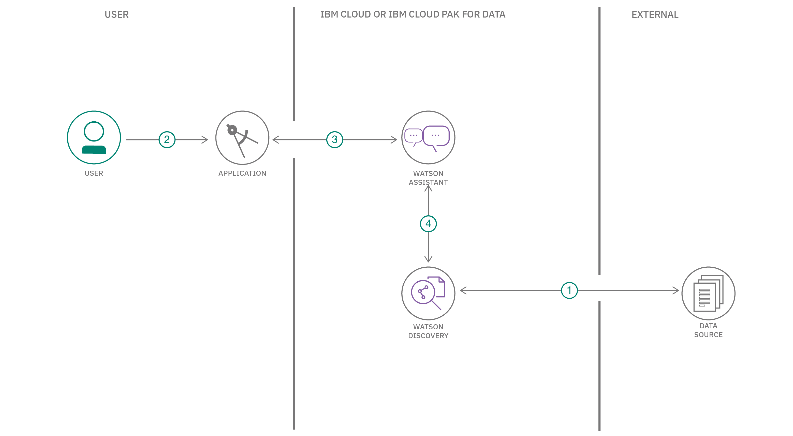

1. The document is annotated using Watson Discovery SDU
1. The user interacts with the backend server via the app UI. The frontend app UI is a chatbot that engages the user in a conversation.
1. Dialog between the user and backend server is coordinated using a Watson Assistant dialog skill.
1. If the user asks a product operation question, a search query is issued to the Watson Discovery service via a Watson Assistant search skill.

>**NOTE**: This video is using `V1` versions of both Watson Discovery and Assistant. The concepts are similar in `V2`, but the navigation steps may be different.

# Steps:

1. [Create Watson services](#2-create-watson-services)
1. [Configure Watson Discovery](#3-configure-watson-discovery)
1. [Configure Watson Assistant](#4-configure-watson-assistant)
1. [Add Watson service credentials to environment file](#5-add-watson-service-credentials-to-environment-file)
1. [Run the application](#6-run-the-application)

### 1. Create Watson services

Create the following services:

* **Watson Assistant**
* **Watson Discovery**

<h5>Create the service instances</h5>
  <ul>
    <li>If you do not have an IBM Cloud account, register for a free trial account <a href="https://cloud.ibm.com/registration">here</a>.</li>
    <li>Create a <b>Assistant</b> instance from <a href="https://cloud.ibm.com/catalog/services/watson-assistant">the catalog</a>.</li>
    <li>Create a <b>Discovery</b> instance from <a href="https://cloud.ibm.com/catalog/services/discovery">the catalog</a> and select the default "Plus" plan.</li>
  </ul>

### 2. Configure Watson Discovery

From the IBM Cloud dashboard, click on your new Discovery service in the resource list.

  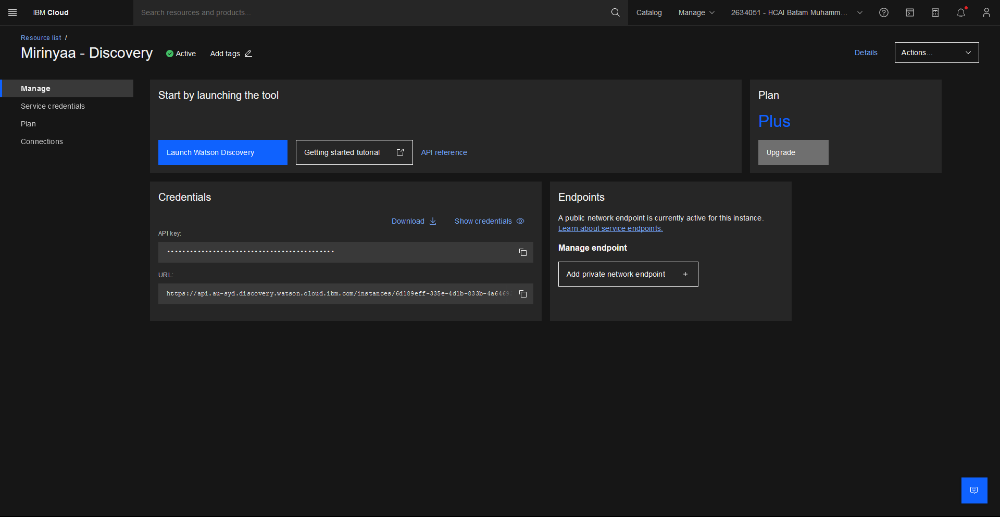

From the `Manage` tab panel of your Discovery service, click the `Launch Watson Discovery` button.

### Create a project and collection

The landing page for Watson Discovery is a panel showing your current projects.

Create a new project by clicking the `New Project` tile.

  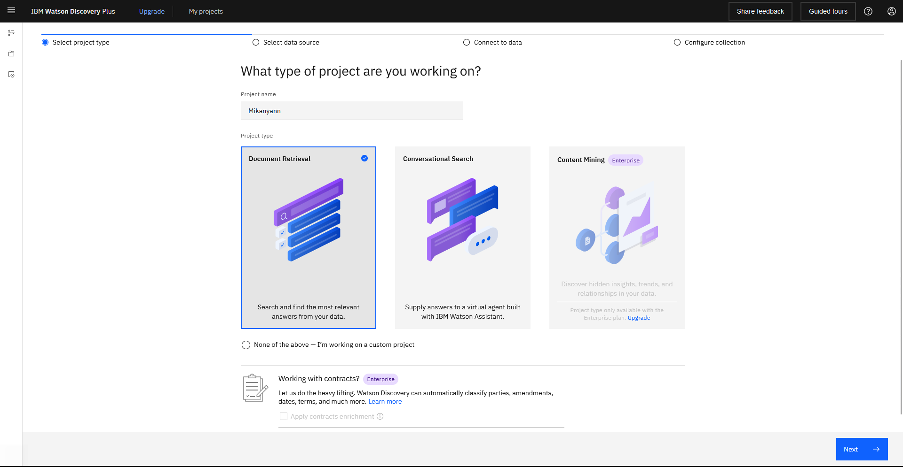

Give the project a unique name and select the `Document Retrieval` option, then click `Next`.

  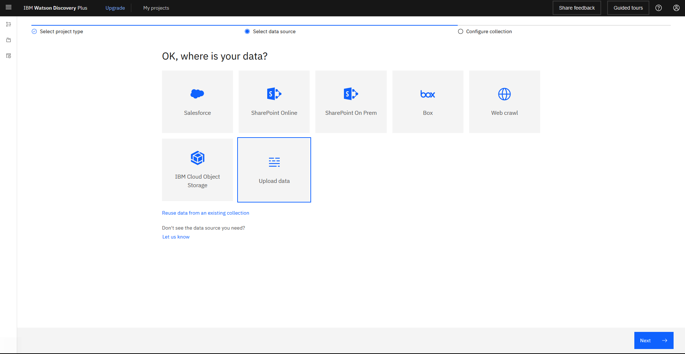

For data source, click on the `Upload data` tile and click `Next`.

  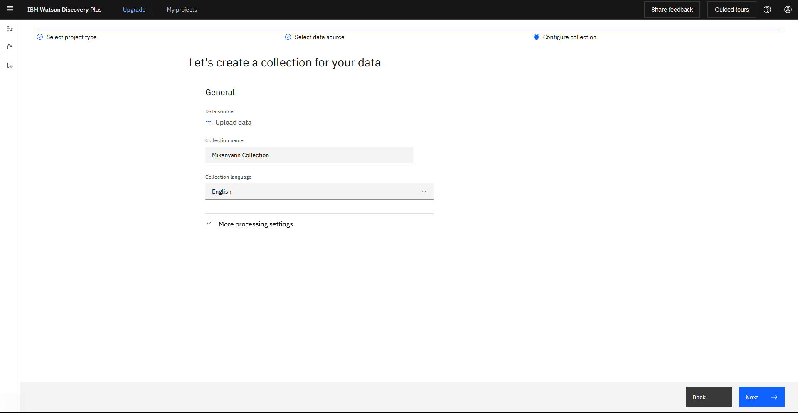

Enter a unique name for your collection and click `Finish`.

### Import the document

On the `Configure Collection` panel, click the `Drag and drop files here or upload` button to select and upload the `ecobee3_UserGuide.pdf` file located in the `data` directory of your local repo.

  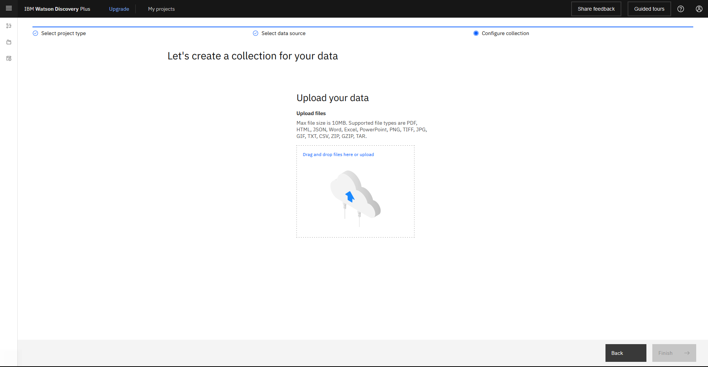

>**NOTE**: The `Ecobee` is a popular residential thermostat that has a wifi interface and multiple configuration options.

Once the file is loaded, click the `Finish` button.

Note that after the file is loaded it may take some time for Watson Discovery to process the file and make it available for use. You should see a notification once the file is ready.

### Access the collection

To access the collection, make sure you are in the correct project, then click the `Manage Collections` tab in the left-side of the panel.

  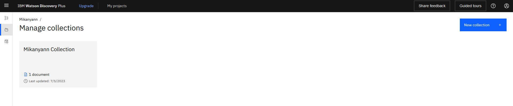

Click the collection tile to access it.

  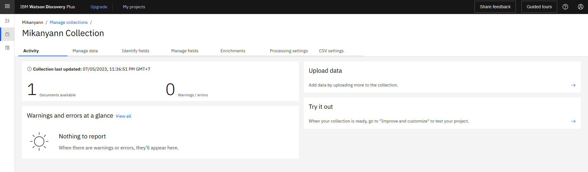

Before applying Smart Document Understanding (SDU) to our document, lets do some simple queries on the data so that we can compare it to results found after applying SDU. Click the `Try it out` panel to bring up the query panel.

  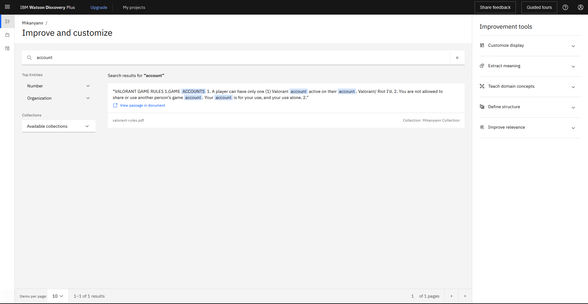

Enter queries related to the operation of the thermostat and view the results. As you will see, the results are not very useful, and in some cases, not even related to the question.

### Annotate with SDU

Now let's apply SDU to our document to see if we can generate some better query responses.

  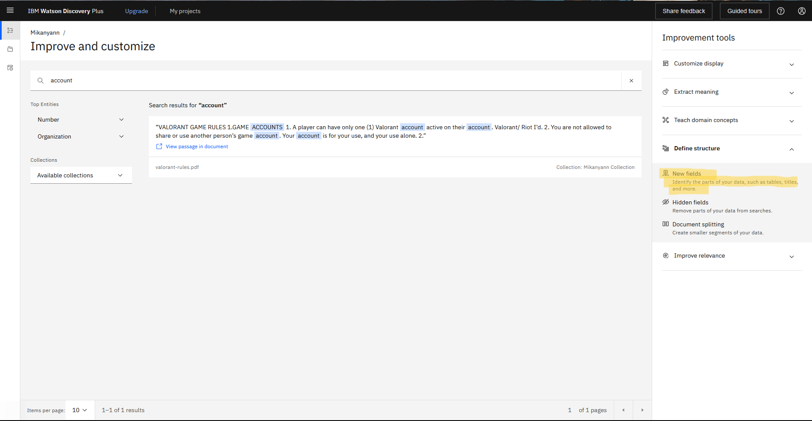

From the `Define structure` drop-down menu, click on `New fields`.

  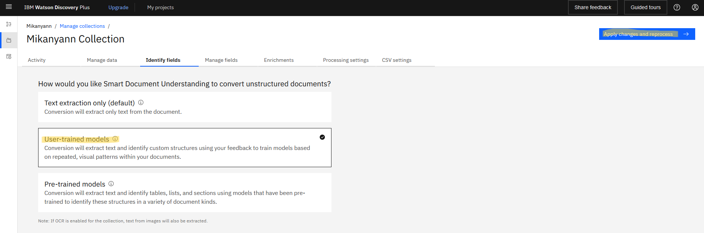

From the `Identify fields` tab panel, click on `User-trained models`, the click `Submit` from the confirmation dialog.

Click the `Apply changes and reprocess` button in the top right corner. This will SDU process.

Here is the layout of the SDU annotation panel:

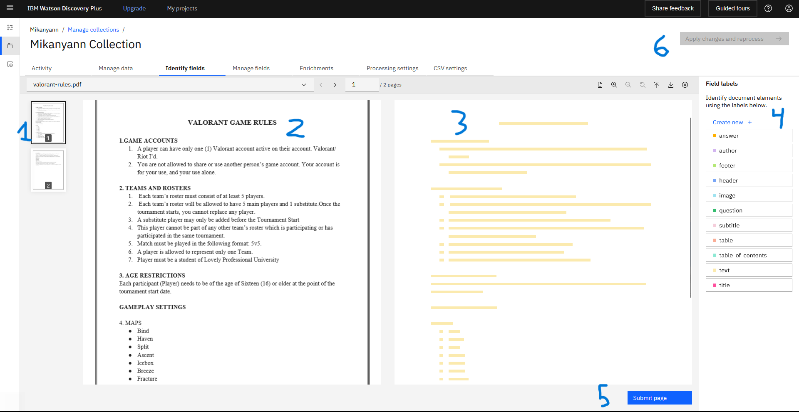

The goal is to annotate all of the pages in the document so Discovery can learn what text is important, and what text can be ignored.

* [1] is the list of pages in the manual. As each is processed, a green check mark will appear on the page.
* [2] is the current page being annotated.
* [3] is a graphic display of the same page, but allows you to select regions that you can label.
* [4] is the list of labels you can assign to the graphic page.
* Click [5] to submit the page to Discovery.
* Click [6] when you have completed the annotation process.

To add/change a label, select the new label, then click on the text areas in the graphic page to apply it.

As you go though the annotations one page at a time, Discovery is learning and should start automatically updating the upcoming pages. Once you get to a page that is already correctly annotated, you can stop, or simply click `Submit` [5] to acknowledge it is correct. The more pages you annotate, the better the model will be trained.

For this specific owner's manual, at a minimum, it is suggested to mark the following:

* The main title page as `title`
* The table of contents (shown in the first few pages) as `table_of_contents`
* All headers and sub-headers (typed in light green text) as a `subtitle`
* All page numbers as `footers`
* All circuitry diagram pages (located near the end of the document) as a `footer`
* All licensing information (located in the last few pages) as a `footer`
* All other text should be marked as `text`.

Click the `Apply changes and reprocess` button [6] to load your changes. Wait for Discovery to notify you that the reprocessing is complete.

Next, click on the `Manage fields` [1] tab.

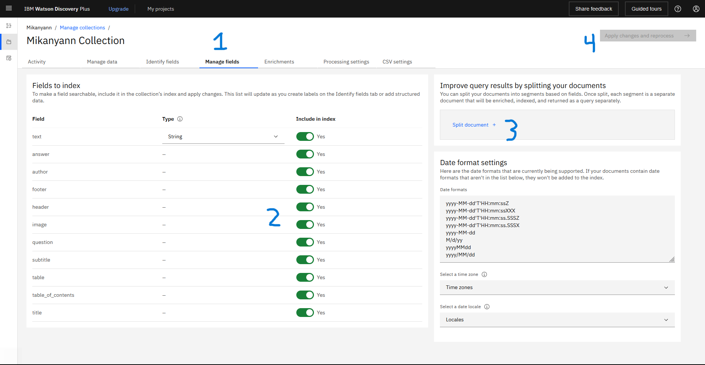

* [2] Here is where you tell Discovery which fields to ignore. Using the `on/off` buttons, turn off all labels except `subtitles` and `text`.
* [3] is telling Discovery to split the document apart, based on `subtitle`.
* Click [4] to submit your changes.

Return to the `Activity` tab. After the changes are processed (may take some time), your collection will look very different:

Return to the query panel (click `Try it out`) and see how much better the results are.

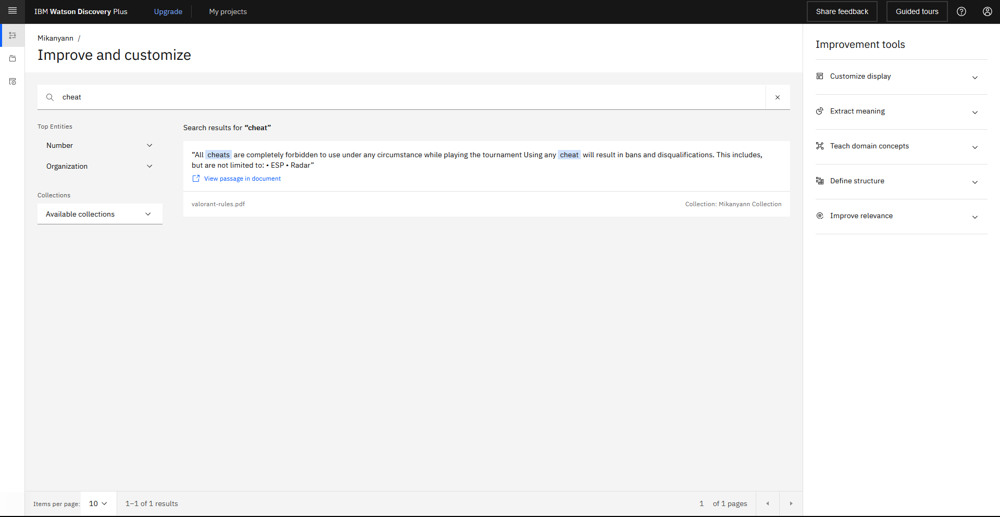

### 4. Configure Watson Assistant

The instructions for configuring Watson Assistant are basically the same for both IBM Cloud Pak for Data and IBM Cloud.

One difference is how you launch the Watson Assistant service. Click to expand:

<b>IBM Cloud</b>

Find the Assistant service in your IBM Cloud Dashboard.

Click on the service and then click on Launch tool.

### Create assistant

From the main Assistant panel, you will see 2 tab options - `Assistants` and `Skills`. An `Assistant` is the container for a set of `Skills`.

Go to the Assistant tab and click `Create assistant`.

  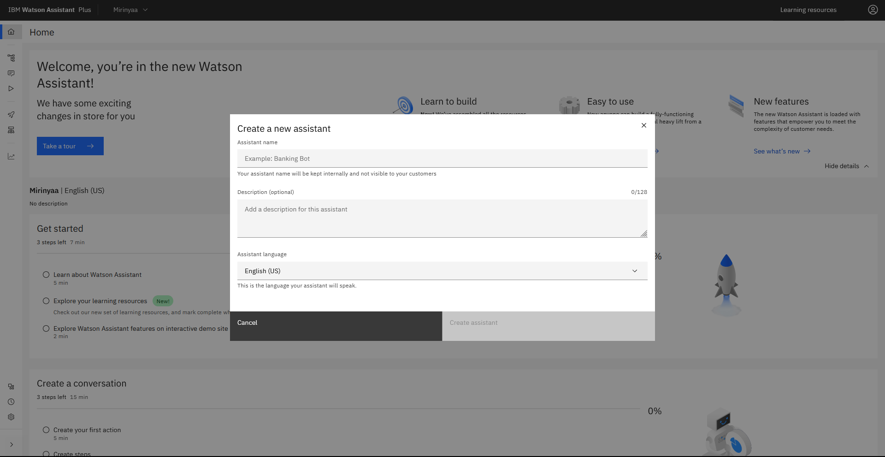

Give your assistant a unique name then click `Create assistant`.

#### Add new intent

The default customer care dialog does not have a way to deal with any questions involving outside resources, so we will need to add this.

Create a new `intent` that can detect when the user is asking about operating the Ecobee thermostat.

From the `Customer Care Sample Skill` panel, select the `Intents` tab.

Click the `Create intent` button.

Name the intent `#Product_Information`, and at a minimum, enter the following example questions to be associated with it.

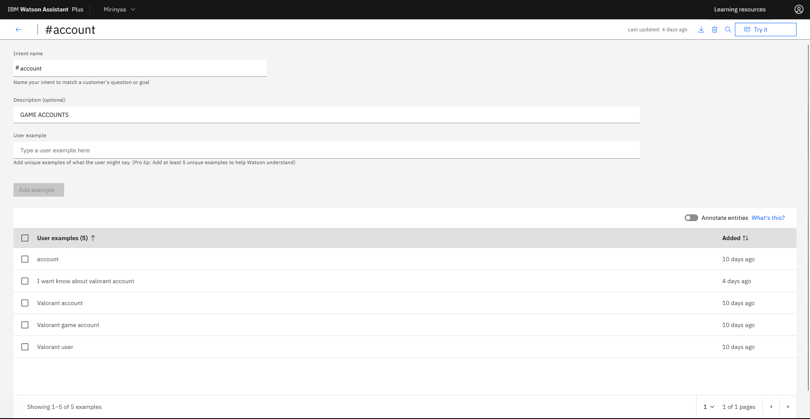

#### Create new dialog node

Now we need to add a node to handle our intent. Click on the back arrow in the top left corner of the panel to return to the main panel. Click on the `Dialog` tab to bring up the nodes defined for the dialog.

Select the `What can I do` node, then click on the drop down menu and select the `Add node below` option.

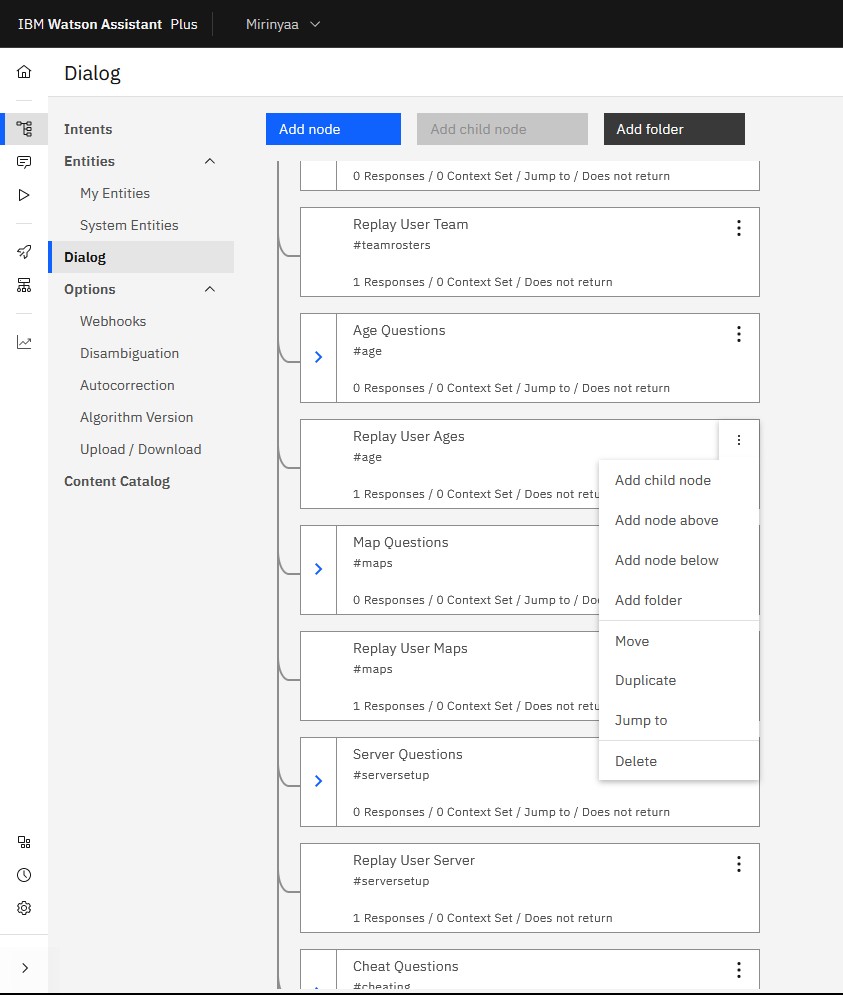

Name the node "Ask about product" [1] and assign it our new intent [2].

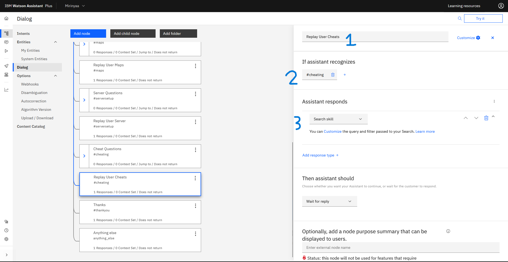

In the `Assistant responds` dropdown, select the option `Search skill`.

This means that if Watson Assistant recognizes a user input such as "how do I set the time?", it will direct the conversation to this node, which will integrate with the search skill.

### Create Assistant search skill

Return to the Skills panel by clicking the `Skills` icon in the left menu pane.

From your Assistant skills panel, click on `Create skill`.

For `Skill Type`, select `Search skill` and click `Next`.

> **Note**: If you have provisioned Watson Assistant on IBM Cloud, the search skill is only offered on a paid plan, but a 30-day trial version is available if you click on the `Plus` button.

Give your search skill a unique name, then click `Continue`.

From the search skill panel, select the Discovery service instance and collection you created previously.

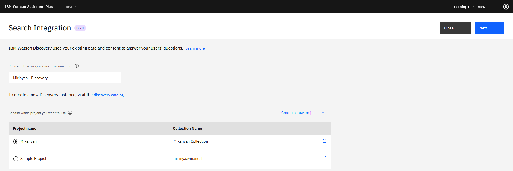

Click `Configure` to continue.

From the `Configure Search Response` panel, select `text` as the field to use for the `Body` of the response.

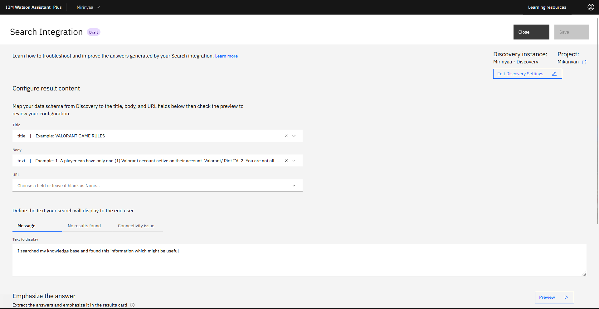

You can also customize the return `Message` to be more appropriate for your use case.

Click `Create` to complete the configuration.

Now when the dialog skill node invokes the search skill, the search skill will query the Discovery collection and display the text result to the user.

### Test in Assistant Tooling

Normally, you can test the dialog skill be selecting the `Try it` button located at the top right side of the dialog skill panel, but when integrated with a search skill, a different method of testing must be used.

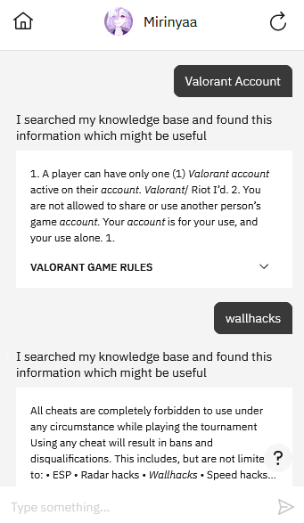

You will also need the credentials for your Assistant service. What credentials you will need will depend on if you provisioned Watson Assistant on IBM Cloud Pak for Data or on IBM Cloud. Click to expand one:

# Result Output

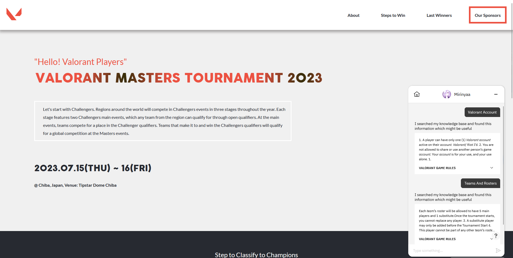
